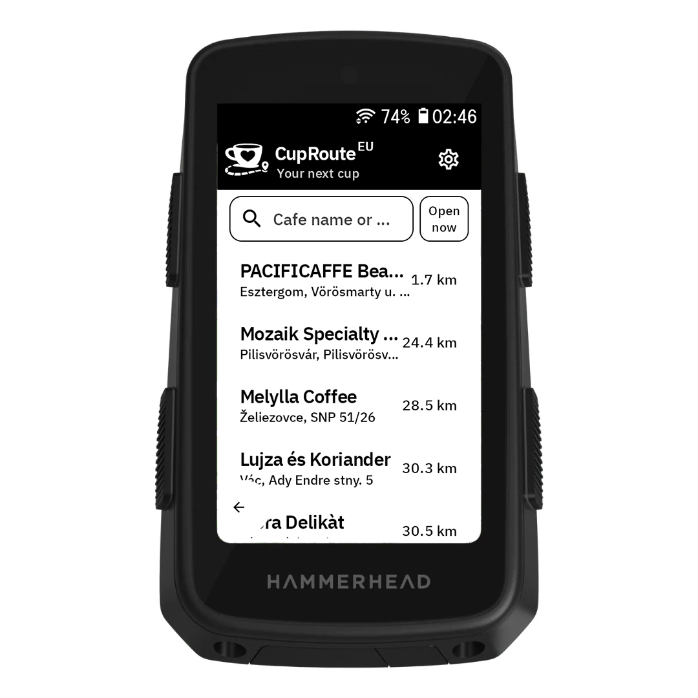

# CupRoute app for Hammerhead Karoo

TL;DR: I built this app to quickly find a good coffee shop nearby while you are on your route.

Long version: A few days ago I bought my Hammerhead Karoo 3. While exploring it, I found the excellent [`awesome-karoo`](https://github.com/timklge/awesome-karoo) curated list of extensions. I saw there is an official SDK from Hammerhead and wanted to build something right away. Since I love coffee, I built an offline coffee shop map so I can quickly find great cafes around me. I hope you like it and find it useful. ☕🚴‍♂️

  

  <em>Fully offline speciality coffee shop finder for Karoo.</em>

---

## Features
- ☕ Fully offline, European speciality coffee shop database.
- 🔎 Search cafes by name or city.
- 📍 Sort cafes by distance using current location.
- 🕒 Filter places by open now.
- 🧭 Open a cafe location in Karoo navigation.

## Installation and usage videos
<table>
  <tr>
    <td align="center"><strong>Installation</strong></td>
    <td align="center"><strong>Usage</strong></td>
  </tr>
  <tr>
    <td>
      <video src="resource/installation-cuproute.mp4" controls></video>
    </td>
    <td>
      <video src="resource/karoo-capcut.mp4" controls></video>
    </td>
  </tr>
</table>
